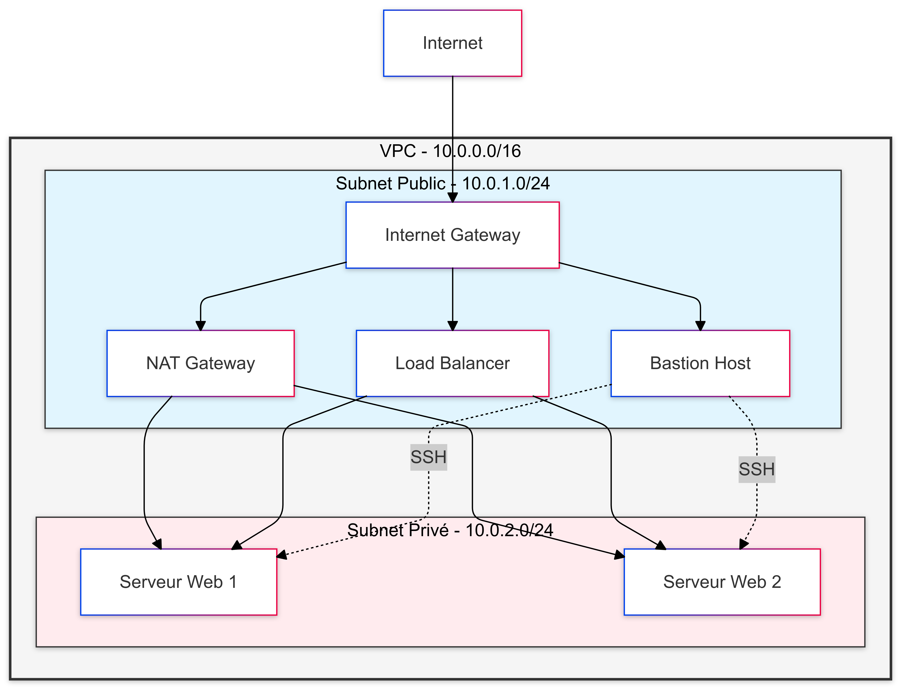

# Documentation Infrastructure Cloud avec Terraform

## Auteurs
| Nom                                    | Contact                                            |
|----------------------------------------|----------------------------------------------------|
| Mohamed Matrab                         | mohamed.matrab@epita.fr                            |

---

## Table des matières
1. [Introduction](#introduction)
2. [Architecture](#architecture)
3. [Concepts Clés](#concepts-clés)
4. [Prérequis](#prérequis)
5. [Structure du Projet](#structure-du-projet)
6. [Guide Pas à Pas](#guide-pas-à-pas)
7. [Tests et Validation](#tests-et-validation)
8. [Dépannage](#dépannage)
9. [Maintenance](#maintenance)

## Introduction

Ce projet implémente une infrastructure cloud sécurisée sur 3DS OUTSCALE en utilisant Terraform. L'architecture comprend un VPC avec des sous-réseaux public et privé, un bastion host pour l'accès SSH sécurisé, et des serveurs web redondants derrière un équilibreur de charge.

## Architecture

### Composants
- **VPC (10.0.0.0/16)**
  - Sous-réseau public (10.0.1.0/24)
  - Sous-réseau privé (10.0.2.0/24)
  - Internet Gateway
  - NAT Gateway

- **Instances**
  - Bastion (sous-réseau public)
  - 2 serveurs web (sous-réseau privé)

- **Sécurité**
  - Groupes de sécurité distincts pour chaque composant
  - Accès SSH via bastion uniquement
  - Load Balancer pour distribution du trafic web

### Diagramme d'Architecture


## Concepts Clés pour Non-Spécialistes

### Composants de Base

#### VPC (Virtual Private Cloud)
  Un VPC est comme un centre de données virtuel privé dans le cloud. C'est un espace isolé où vous pouvez déployer vos ressources en toute sécurité. Imaginez-le comme un immeuble sécurisé avec différents étages (subnets).

#### Subnets (Sous-réseaux)
Les subnets sont des divisions de votre VPC. Notre architecture utilise deux types :
  - **Subnet Public** : Accessible depuis Internet, comme le hall d'entrée de l'immeuble
  - **Subnet Privé** : Protégé d'Internet, comme les étages sécurisés de l'immeuble

#### Bastion Host
Le bastion est comme un gardien de sécurité. C'est le seul point d'entrée autorisé pour accéder à vos serveurs. Il permet de :
  - Centraliser les accès
  - Renforcer la sécurité
  - Auditer les connexions

#### Load Balancer (Équilibreur de charge)
Le load balancer est comme un répartiteur de trafic. Il :
  - Distribue les visiteurs entre différents serveurs
  - Assure une haute disponibilité
  - Protège contre les surcharges

### Sécurité

#### Security Groups (Groupes de Sécurité)
Fonctionnent comme des gardiens virtuels qui :
  - Contrôlent qui peut accéder à quoi
  - Définissent des règles précises (qui peut parler à qui)
  - Protègent chaque composant individuellement

#### NAT Gateway
Permet aux serveurs privés d'accéder à Internet sans être exposés directement, comme un intermédiaire de confiance.

### Haute Disponibilité

Notre architecture assure une haute disponibilité grâce à :
  - Plusieurs serveurs web
  - Répartition automatique du trafic
  - Surveillance continue de la santé des serveurs

### Pourquoi Cette Architecture ?

1. **Sécurité** :
   - Serveurs web protégés dans le réseau privé
   - Accès contrôlé via le bastion
   - Filtrage du trafic à plusieurs niveaux

2. **Performance** :
   - Distribution de charge automatique
   - Adaptation aux pics de trafic
   - Temps de réponse optimisé

3. **Maintenabilité** :
   - Configuration centralisée avec Terraform
   - Mises à jour facilitées
   - Surveillance simplifiée

## Prérequis

- Compte 3DS OUTSCALE actif
- Access Key et Secret Key OUTSCALE
- Terraform v1.0.0 ou supérieur
- Client SSH
- Ubuntu 22.04 ou supérieur pour les instances

## Structure du Projet
```
project-root/
├── README.md
├── docs/
│   ├── rapport.md
│   └── mermaid-diagram.png
├── scripts/
│   └── install_web.sh
└── terraform/
    ├── main.tf
    ├── variables.tf
    ├── terraform.tfvars
    ├── outputs.tf
    ├── providers.tf
    ├── network.tf
    ├── security.tf
    ├── compute.tf
    └── loadbalancer.tf
```

## Guide Pas à Pas

### Première Utilisation

1. **Préparation**
   ```bash
   # Copier le fichier d'exemple
   cp terraform.tfvars.example terraform.tfvars
   
   # Éditer le fichier avec vos identifiants
   nano terraform.tfvars
   ```

2. **Initialisation**
   ```bash
   cd terraform
   terraform init
   ```
   Cette commande télécharge les plugins nécessaires.

3. **Vérification**
   ```bash
   terraform plan
   ```
   Examinez les ressources qui seront créées.

4. **Déploiement**
   ```bash
   terraform apply
   ```
   Confirmez avec "yes" quand demandé.

### Vérification du Déploiement

1. **Connexion au Bastion**
   ```bash
   # La commande exacte est fournie dans les outputs
   ssh -i ssh_key.pem outscale@<BASTION_IP>
   ```

2. **Test des Serveurs Web**
   ```bash
   # Depuis le bastion
   ssh outscale@<WEB_SERVER_IP>
   
   # Vérifier Apache
   systemctl status apache2
   ```

3. **Test du Load Balancer**
   - Ouvrez l'URL du load balancer dans un navigateur
   - Faites plusieurs rafraîchissements
   - Observez l'alternance entre les serveurs

### Maintenance Courante

1. **Mise à Jour de l'Infrastructure**
   ```bash
   # Appliquer des modifications
   terraform apply
   ```

2. **Ajout de Serveurs**
   - Modifiez `instance_count` dans terraform.tfvars
   - Exécutez `terraform apply`

3. **Surveillance**
   - Vérifiez les logs Apache
   - Surveillez les health checks du load balancer
   - Monitored le trafic réseau

### Arrêt et Nettoyage

1. **Destruction de l'Infrastructure**
   ```bash
   terraform destroy
   ```

2. **Nettoyage Local**
   ```bash
   ./cleanup.sh
   ```

### Résolution des Problèmes Courants

1. **Erreur de Connexion SSH**
   - Vérifiez les permissions de la clé
   - Confirmez que le bastion est accessible
   - Vérifiez les règles de sécurité

2. **Serveur Web Inaccessible**
   - Vérifiez le statut Apache
   - Contrôlez les règles de sécurité
   - Vérifiez les logs

## Tests et Validation

### 1. Accès SSH au Bastion
```bash
# Configuration de la clé SSH
chmod 400 ssh_key.pem

# Connexion au bastion
ssh -i ssh_key.pem outscale@<BASTION_IP>
```

### 2. Accès aux Serveurs Web
Depuis le bastion :
```bash
# Configuration des clés sur le bastion
mkdir -p ~/.ssh
chmod 700 ~/.ssh
chmod 600 ~/.ssh/id_rsa

# Connexion aux serveurs web
ssh outscale@10.0.2.241  # Serveur Web 1
ssh outscale@10.0.2.23   # Serveur Web 2
```

### 3. Test du Load Balancer
```bash
# Test d'accès au load balancer
curl http://<LOAD_BALANCER_DNS>

# Test de répartition de charge
for i in {1..10}; do 
  curl -s http://<LOAD_BALANCER_DNS> | grep "Hostname"
  sleep 1
done
```

## Dépannage

### Problèmes Courants

1. **Problème d'accès SSH**
   - Vérifier les permissions de la clé (chmod 400)
   - Vérifier les groupes de sécurité
   - Vérifier la connectivité réseau

2. **Serveur Web Inaccessible**
   - Vérifier le statut Apache : `systemctl status apache2`
   - Vérifier les logs : `sudo tail /var/log/apache2/error.log`
   - Vérifier les règles de sécurité

3. **Load Balancer**
   - Vérifier l'enregistrement des instances
   - Vérifier les health checks
   - Vérifier les règles de sécurité

## Maintenance

### Mise à Jour de l'Infrastructure
```bash
terraform plan    # Vérifier les changements
terraform apply   # Appliquer les changements
```

### Nettoyage
```bash
terraform destroy # Supprimer toute l'infrastructure
```

### Sauvegardes
- State Terraform : Conserver terraform.tfstate
- Clés SSH : Sauvegarder ssh_key.pem

## Notes de Sécurité

- Les clés SSH sont générées automatiquement
- Accès SSH uniquement via le bastion
- Serveurs web dans le réseau privé
- Trafic web filtré par le load balancer
